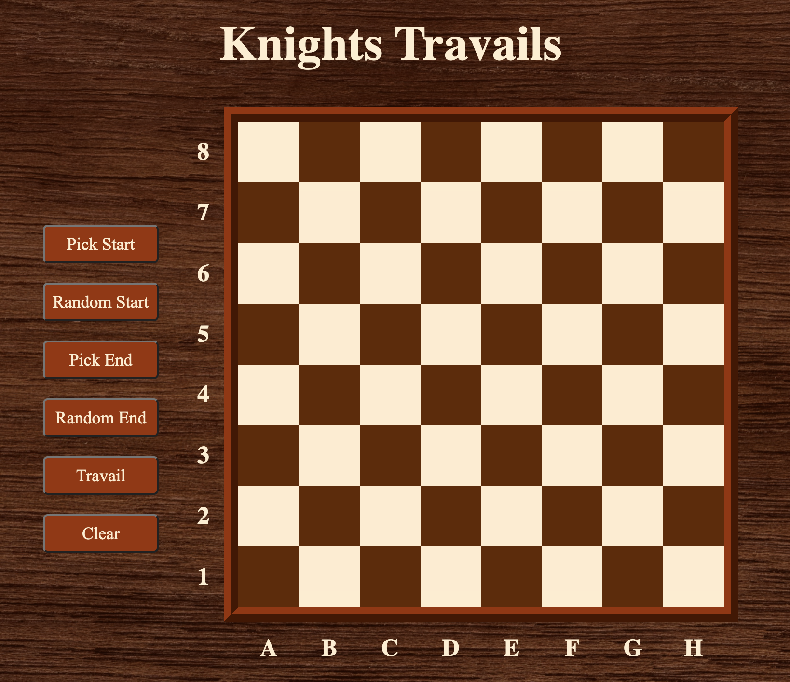

# Knights Travails

## Overview

A program that shows the most efficient route for a knight piece to get from a start position to an end position.

## Usage

Choose your own start and end positions by clicking "Pick Start" or "Pick End" buttons and selecting a square on the board. Alternatively, log random knight positions by selecting the "Random Start" or "Random End" options.

Once a start and end square is highlighted, visualize the most efficient knight path by selecting the "Travail" button.

[Live Demo](https://dukdukg00se.github.io/knights-travails/)

## Learning Objectives

Educational goals when building this application:

- Learn and implement basic computer science concepts (implemented within the data modules):
  - Recursion
  - Data structures i.e., linked lists, queues
  - Algorithms i.e., BFS, DFS,

## Credits

- Page background image by [rawpixel.com](https://www.freepik.com/free-photo/wooden-textured-background_2768392.htm#query=wood%20background&position=5&from_view=keyword) from [Freepik](https://www.freepik.com).

- Knight svg from [SVGREPO](https://www.svgrepo.com/svg/173179/chess-knight).
